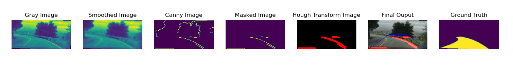

# lane-detection

In this repository, we are aiming to explore traditional and smart ways to segment and detect lanes to assist with automated driving. We will be using a deep learning approach involving a UNET to detect and segment the current driving lane.

## Classical Approach Pipeline
* Convert the image to grayscale
* Using thresholding to see as a baseline to see what percentage of the lanes we can already detect
* Cropping the image and creating an area of interest mask to focus our attention, since mounted cameras can be assumed to have approximately the same position.
* Using the Canny edge detection technique and tuning its parameters to get the best output within our area of interest
* Using Hough transform to detect line segments.



## Deep Learning Pipeline
* Load dataset (training images and labels)
* Normalise the dataset, reshape it as per input of model
* Shuffle, split and make batches
* Create an instance of the model, pass hyperparameters, train on the train split of the dataset
* Save weights and model
* Test on images and on videos for performance comparison across different environment settings. 
* Output IoU (Intersection over Union) for prediction of input image and test split of the dataset to generate data on model performance


## Testing performance
* Test on test images
* Test real-time performance by applying to a 30 FPS video

## Video Demo

<b>Normal Difficulty Video </b>

<video width="320" height="240" controls>
  <source src="tests/normal_video_predicted.mp4" type="video/mp4">
</video>

<hr>

<b> Harder Difficulty Video </b>

<video width="320" height="240" controls>
  <source src="tests/challenge_video_predicted.mp4" type="video/mp4">
</video>

<hr>

<b> Challenging Difficulty Video </b>

<video width="320" height="240" controls>
  <source src="tests/harder_challenge_predicted.mp4" type="video/mp4">
</video>


## Difficulties
* The classical pipeline struggles to adjust to different times of the day, curvature in lanes, and different colours of the lanes themselves.
* Only able to load 6k images from the dataset. Need to figure out if custom dataset generator will be able to solve memory related issues.
* The deep learning approach suffers from detection issues when harsh sunlight causes overexposure of lanes, or camera flashes. Apart from sudden changes inbrightness, it appears, extreme bends in roads are not predicted well. This could be from lack of samples in the training set. 

## Installation

Clone the repository into your workspace and create a new environment with python version 3.9. My preferred way of doing this is using Mamba.

```
mamba create -n <name_of_environment> python=3.9
```

After creating the environment, activate it

```
mamba activate <name_of_environment>
```

Install the dependencies from the requirements.txt
```
mamba install --file requirements.txt
```

If you face any issues with the download of the dependencies, download the ones that you can, install the rest using `pip install <package-name>`. After that you will need to make sure all the versions are compatible with each other.

The dataset images can be found [here](https://www.dropbox.com/s/rrh8lrdclzlnxzv/full_CNN_train.p?dl=0) and the labels can be found [here](https://www.dropbox.com/s/ak850zqqfy6ily0/full_CNN_labels.p?dl=0).

NOTE: To run the training of the model on your local GPU, you will have to find the instructions specific to your GPU and install the relevant drivers and packages.